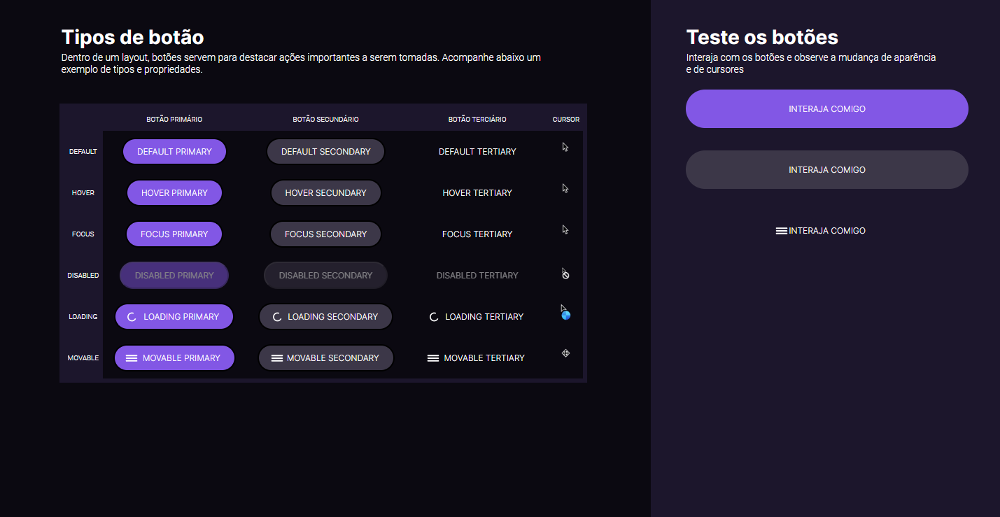

# Tipos de Botões

## Descrição do Projeto

Uma página com diversos exemplos de estilos de botões, feita para o desafio #03 do #boraCodar da @Rocketseat.

<h1 align="center">
  
</h1>

### 🛠 Tecnologias

As seguintes ferramentas foram usadas na construção do projeto:

- [HTML](https://developer.mozilla.org/pt-BR/docs/Web/HTML)
- [CSS](https://developer.mozilla.org/pt-BR/docs/Web/CSS)
- [Javascript](https://developer.mozilla.org/pt-BR/docs/Web/JavaScript)

### Autor
---

Feito por Nathalia Azevedo 👋🏽 Entre em contato!

